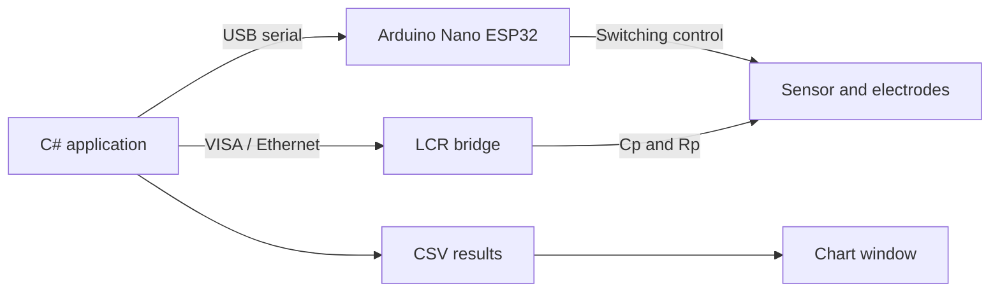

# LCR Bridge Measurement and Control Application

Desktop application developed in C# for controlling automated electrical spectroscopy experiments. The software coordinates an **Arduino Nano ESP32**, an **LCR bridge**, and the experimental sensor, allowing the user to configure frequency sweeps, select measurement modes, acquire capacitance and resistance data, save the results, and visualize them using integrated charts.

The application was developed for laboratory characterization of capacitive and impedance sensors, including the multi-electrode sensor used in the experimental gas-hydrate and multiphase-flow setups.

## Main Features

- Serial communication with an Arduino Nano ESP32.
- Communication with a VISA-compatible LCR bridge.
- Automated frequency sweep configuration.
- Acquisition of parallel capacitance (`Cp`) and parallel resistance (`Rp`).
- Sequential execution of multiple measurement points.
- Continuous or predefined loop operation.
- Automatic measurement-time recording.
- CSV data export and import.
- Manual command and communication monitoring.
- Experimental configuration through a Windows Forms interface.
- Nyquist and Cp/Rp chart visualization.

## Experimental Setup

The measurement system contains three main elements:

1. **C# application**  
   Controls the experiment, sends commands, reads the LCR bridge, displays the acquired values, and saves the results.

2. **Arduino Nano ESP32**  
   Controls the hardware associated with the experiment, such as electrode selection and switching. It communicates with the computer through a USB serial connection.

3. **LCR bridge**  
   Performs the electrical measurements at each frequency. The current setup uses a Keysight E4980A or another VISA-compatible instrument configured to return the parallel-equivalent parameters `Cp` and `Rp`.



### Typical Connection

- Connect the Arduino Nano ESP32 to the computer using USB.
- Connect the sensor-switching circuit to the Arduino.
- Connect the selected sensor electrodes to the LCR bridge.
- Connect the LCR bridge to the computer through Ethernet.
- Confirm that the instrument is available in the installed VISA connection utility.
- Open the application and select the correct serial port.
- Enter the LCR bridge VISA address or the configured instrument address.

> The Arduino and the LCR bridge perform different tasks. The Arduino controls the experimental hardware, while the LCR bridge performs the electrical measurement.

## Software Requirements

- Windows 10 or Windows 11.
- Visual Studio with C# Windows Forms support.
- .NET version configured by the project.
- DevExpress WinForms components.
- VISA-compatible I/O library, such as Keysight IO Libraries Suite.
- Arduino USB serial driver, when required by the operating system.

The main namespaces used by the application include:

```csharp
using System;
using System.Diagnostics;
using System.Globalization;
using System.IO;
using System.IO.Ports;
using System.Linq;
using System.Windows.Forms;
using DevExpress.XtraCharts;
```

Additional namespaces may be required according to the VISA library referenced by the project.

## Arduino Nano ESP32 Setup

The Arduino firmware must:

- Initialize the serial interface with the same baud rate selected in the C# application.
- Receive the electrode or measurement command.
- Activate the requested switching configuration.
- Return a confirmation or expected response.
- Keep the serial message format consistent with the C# parser.

When using PlatformIO, the basic environment is:

```ini
[env:arduino_nano_esp32]
platform = espressif32
board = arduino_nano_esp32
framework = arduino
```

Before starting a measurement, verify the Arduino independently with a serial monitor. Close the serial monitor before opening the COM port in the C# application because only one program can normally use the port at a time.

## LCR Bridge Setup

The LCR bridge should be configured for the parallel-equivalent circuit:

- `Cp`: parallel capacitance, in farads.
- `Rp`: parallel resistance, in ohms.

Recommended preparation:

1. Allow the instrument to complete its initialization.
2. Select the required test-signal amplitude.
3. Configure the desired frequency range.
4. Perform open, short, and load compensation when required by the fixture.
5. Confirm that the computer can identify the instrument through VISA.
6. Test the instrument connection before running a complete sweep.

The application communicates with the LCR bridge at every point in the frequency list. The measured `Cp` and `Rp` values are associated with the current electrode mode and saved in the output file.

## Measurement Workflow

1. Connect the Arduino and the LCR bridge.
2. Select the serial port and communication parameters.
3. Configure the output directory and filename.
4. Add or load the desired sweep frequencies.
5. Select the electrode or differential measurement sequence.
6. Configure the number of repetitions or enable loop mode.
7. Start the measurement.
8. For each measurement point, the application:
   - sends the switching command to the Arduino;
   - waits for the hardware response;
   - configures the LCR bridge frequency;
   - reads `Cp` and `Rp`;
   - updates the interface;
   - writes the acquired data to the output file.
9. At the end of the sweep, the application stops the timer, enables the Start button, reports the elapsed time, and optionally opens or updates the chart.

## Sweep and Loop Modes

The sweep list defines the frequencies used by the LCR bridge. Measurements may be executed once or repeated using loop mode.

At the end of a loop:

- the sweep timer is stopped;
- the total elapsed time is displayed;
- the chart path is updated;
- the saved measurement file can be loaded automatically;
- the loop counter is reset after all requested measurements are complete.

All controls updated after a background acquisition must be accessed from the user-interface thread. Use `BeginInvoke` only when the current code is running outside that thread.

Example:

```csharp
BeginInvoke(new Action(() =>
{
    sweepTimer.Stop();
    btnStart.Enabled = true;
    richTextBox1.AppendText("Measurement finished!\r\n");

    double elapsedTime =
        sweepTimer.Elapsed.TotalMilliseconds;

    tbReadSerial.AppendText(
        $"Time elapsed (ms): {elapsedTime}\r\n");
}));
```

Avoid creating unnecessary nested `BeginInvoke` calls. Once execution is already inside the invoked action, chart operations and other interface updates can normally be called directly.

## Output Data

The measurement file stores the experimental mode together with the values obtained across the frequency sweep. For LCR measurements, the data are organized as alternating `Cp` and `Rp` values for each frequency.

Conceptual structure:

```text
Timestamp,Mode,Cp_f1,Rp_f1,Cp_f2,Rp_f2,...,Cp_fn,Rp_fn
```

Example:

```text
2026-07-23 10:30:00,d:1,2.15E-12,8.42E+06,2.21E-12,7.95E+06
```

The exact header depends on the current application export routine. Decimal values should be written and read using a consistent culture configuration to prevent confusion between decimal commas and CSV separators.

## Latest Update: Chart Function

The latest application update adds a dedicated DevExpress chart window for visualizing acquired or previously saved measurements.

Two chart modes are available:

### Nyquist Plot

The Nyquist mode displays the imaginary component as a function of the real component. It is configured through:

```csharp
ChartConfigNyquist();
```

The plot uses a `ScatterLine` series with visible markers, allowing the evolution of the complex response to be inspected across the sweep.

### Cp/Rp Frequency Plot

The Cp/Rp mode displays parallel capacitance and parallel resistance as functions of frequency:

```csharp
ChartConfigCpRp(frequencies, cpValues, rpValues);
```

The same frequency array is used for both data series. The frequency axis can be displayed using a logarithmic scale, which is recommended for wide ranges such as 1 kHz to 1 MHz.

Because `Cp` and `Rp` generally have very different magnitudes and units, the chart uses separate visual scales or axes for the two series.

### Loading a Measurement File

When file-based charting is enabled, the application:

1. validates the selected file path;
2. opens the CSV file;
3. extracts frequency, `Cp`, and `Rp` arrays;
4. configures the selected chart;
5. opens the chart window or brings the existing window to the front.

The file-selection dialog should use `OpenFileDialog`, because the chart requires a measurement file rather than only a directory:

```csharp
using (OpenFileDialog dialog = new OpenFileDialog())
{
    dialog.Filter = "CSV files (*.csv)|*.csv|All files (*.*)|*.*";
    dialog.Title = "Select a measurement file";

    if (dialog.ShowDialog() == DialogResult.OK)
        chartTestEdit.Text = dialog.FileName;
}
```

The main chart flow uses the selected radio-group option:

```csharp
switch (plotRadioGroup.SelectedIndex)
{
    case 0:
        nyquistChartWindow.ChartConfigNyquist();
        break;

    case 1:
        nyquistChartWindow.ChartConfigCpRp(
            frequencies,
            cpValues,
            rpValues);
        break;
}

nyquistChartWindow.Show(this);
nyquistChartWindow.BringToFront();
nyquistChartWindow.Focus();
```

The chart window is reused instead of creating a new form for every click:

```csharp
private DXApplication21.NyquistChart nyquistChartWindow;
```

The update supports:

- live visualization after a completed measurement;
- loading previously saved CSV files;
- Nyquist representation;
- `Cp` and `Rp` versus frequency;
- data markers and line series;
- chart tooltips;
- reuse of the same chart window;
- automatic chart display after loop-mode completion.

## Troubleshooting

### Serial port cannot be opened

- Confirm that the correct COM port is selected.
- Close the Arduino Serial Monitor.
- Disconnect and reconnect the board.
- Confirm that the baud rates are identical.

### Arduino does not respond

- Test the firmware using a serial monitor.
- Confirm that line endings and command separators match the C# protocol.
- Check whether the application is waiting for a response that the firmware does not send.

### LCR bridge is not detected

- Confirm the Ethernet address and VISA resource string.
- Test the connection using the VISA connection utility.
- Check the Windows firewall and local network configuration.
- Confirm that no other program has locked the instrument session.

### Chart is empty

- Confirm that the CSV file exists and contains numeric data.
- Check the selected plot mode.
- Confirm that the frequency, `Cp`, and `Rp` arrays have the same length.
- Check whether the decimal separator matches the file parser.
- Configure the series before accessing the `XYDiagram`.

### Cross-thread exception

Windows Forms controls must be updated from the interface thread. Wrap only the background-thread result in `Invoke` or `BeginInvoke`, and avoid nesting invoked actions unnecessarily.

## Safety and Good Measurement Practices

- Do not change sensor wiring while a measurement is running.
- Confirm that the test-signal level is suitable for the sensor and fixture.
- Perform fixture compensation after changing cables or connections.
- Keep the Arduino, switching circuit, and instrument grounds consistent with the experimental design.
- Save a test file before starting a long loop measurement.
- Verify the first acquired point before leaving the experiment unattended.

## Project Status

The application currently supports serial hardware control, LCR frequency sweeps, automatic data storage, repeated measurements, and graphical analysis.

The most recent development is the integrated **Nyquist and Cp/Rp chart function**, including CSV loading and automatic visualization after measurement completion.

## Authors

Developed for research activities at **NUEM — Multiphase Flow Research Center, UTFPR**.

